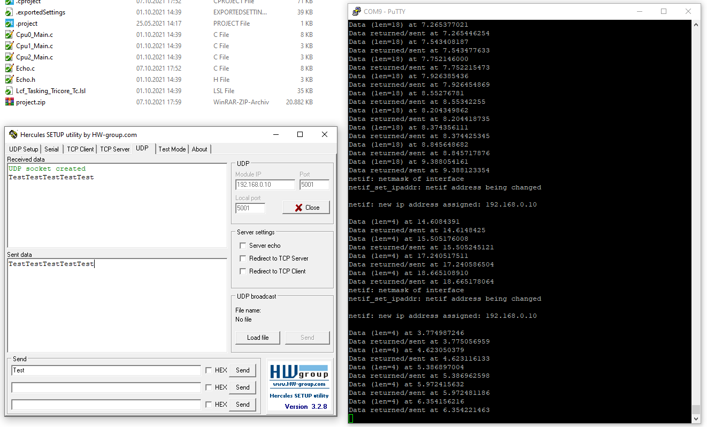

# Aurix TC3xx Ethernet Hardware Timestamping

This Code-Example can be used with the TC375 LiteKit and the Aurix Development Studio and shows how to use the HW-Timestamping feature of the Ethernet-MAC.
It is based on iLLD drivers.

The lwIP pbuf-structure was modified to have an additional field for seconds and nanoseconds. Therfore the RX/TX timestamps can be readback easily by the application software.
See the UDP echo example how it is used.

